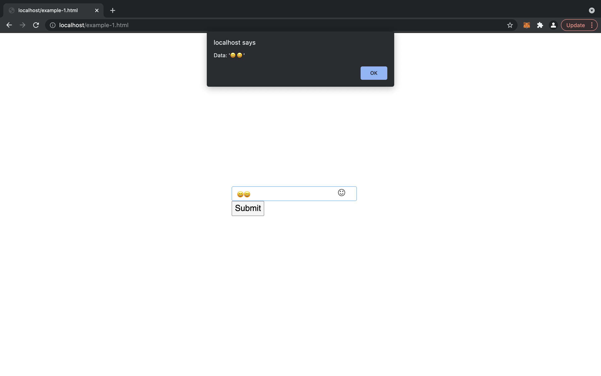

# Steps to run

1. Install docker, docker-compose (Ubuntu and MacOs preferred):

2.

```
docker-compose up -d
```

**Stop**:

docker-compose down

# What it does ?

- Normally, emoji pickers won't bind with vue model, this is kind of work-around solution to make vue binding work

# Screenshot

